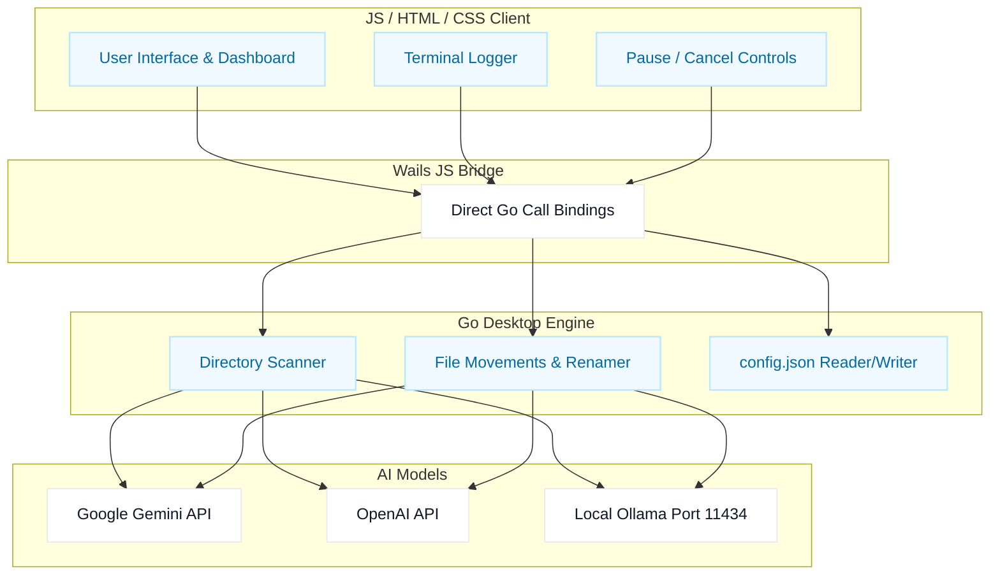

# SortMind AI
### From clutter to order, automate your files in one click.
AI-powered desktop folder organizer built to turn messy folders into structured directories using Gemini, OpenAI, or local Ollama.

`Go` `Wails v2` `JavaScript` `CSS` `Gemini AI` `OpenAI` `Ollama`

[Quick Start](#-getting-started) • [Wails Build](#-scripts) • [GitHub Repository](https://github.com/PAVAN2005-LAB/-SortMind-AI.git) • [User Manual](../../docs/index.html) • [License](#-license)

---

## 📚 Table of Contents
- [Why SortMind AI](#-why-sortmind-ai)
- [Key Features](#-key-features)
- [Tech Stack](#%EF%B8%8F-tech-stack)
- [System Architecture](#-system-architecture)
- [Project Structure](#-project-structure)
- [User Journey](#-user-journey)
- [Configuration and APIs](#-configuration-and-apis)
- [Getting Started](#-getting-started)
- [Scripts](#-scripts)
- [Distribution Strategy](#-distribution-strategy)
- [Troubleshooting](#-troubleshooting)
- [Roadmap](#-roadmap)
- [Contributing](#-contributing)
- [License](#-license)

---

## ✨ Why SortMind AI
Most users struggle with scattered, cluttered folders: downloads filled with unnamed PDFs, receipts with cryptic filenames, and code snippets mixed with vacation photos. Organizing them manually takes hours, and simple extension-based sorting (.pdf, .txt) does not solve the problem.

SortMind AI unifies everything in one lightweight native workflow:
* **Analyze Profile:** Scans any cluttered folder and extracts text snippets, PDF headers, or image metadata.
* **Determine Strategy:** Sends the snippet to an LLM with custom categorization rules.
* **Smart Categorization:** Classifies files into context-aware subfolders (Invoices, Readings, Code, Receipts) based on what the file *actually contains*.
* **Safe Move Execution:** Renames files automatically on collision and runs dry-run previews so you remain in control.

---

## 🌟 What Makes It Stand Out
* **True Native App:** Built with Go + Wails. Runs as a lightweight native desktop window with no browser tabs, no server processes, and under 12 MB in size.
* **Privacy Focused:** Support for local Ollama models allows 100% offline, free, and private file sorting on your local machine.
* **Native OS Integration:** Utilizes native directory dialog boxes to select folders visually.
* **Execution Controls:** Allows pausing, resuming, or cancelling the organization loop mid-way.

---

## 🎯 Key Features

### 👤 Desktop Experience
* Standalone `.exe` binary for Windows and native binary for Linux.
* Desktop window title bar, window controls, and customizable dimensions.
* Native OS folder selection browser.
* Real-time activity logs rendered inside a built-in terminal console.

### 🧠 Sorting Intelligence
* Text content extraction (HTML, JS, CSS, Python, Markdown, CSV, logs).
* Safe PDF header parsing to read document descriptors.
* Image support to read resolution and format, with multimodal capability for Gemini/OpenAI.
* Sequential file-by-file execution queue to manage API rate limits.

### ⚡ Control & Safety
* **AI Preview (Dry Run):** Ask the model for classifications and display predictions without modifying files.
* **Execute Organize:** Physically move files and create folder directories on demand.
* **Pause / Resume:** Suspend processing at any time and resume when ready.
* **Cancel Run:** Abort execution mid-process safely without corrupting folders.
* **Collision Protection:** Automatically renames duplicates incrementally (e.g. `invoice_1.pdf`) to prevent file loss.

---

## 🛠️ Tech Stack

### 🎨 Frontend
* Vanilla HTML5 & ES6 JavaScript
* Custom Light-Theme CSS (minimalist, sharp borders, high-contrast)
* Google Fonts (Inter, JetBrains Mono)
* Wails JS Bindings (Go function calls directly in JavaScript)

### ⚙️ Backend
* Go (Golang 1.26+)
* Wails v2 Desktop Framework (native WebView rendering)
* HTTP client bindings for OpenAI, Gemini, and local Ollama API endpoints

---

## 🧱 System Architecture



---

## 📁 Project Structure

```
SortMind-AI/
├── smart-ai-organizer/      # Go + Wails desktop codebase
│   ├── main.go              # Entry point & window configuration
│   ├── app.go               # Backend controller: API calls, scanning, moving
│   ├── wails.json           # Wails compilation settings
│   ├── go.mod               # Go modules definition
│   ├── build/               # App icons and compiler build assets
│   └── frontend/            # Desktop GUI assets
│       ├── index.html       # UI Layout (Settings, Preview, Terminal)
│       └── src/
│           ├── style.css    # Light-theme corporate styles
│           ├── app.css      # Auxiliary styles
│           └── main.js      # JS controllers, bindings, and Pause/Cancel loop
│
└── docs/                    # Standalone documentation landing page
    ├── index.html           # Stripe-like light docs & User Manual
    └── style.css            # Documentation stylesheets
```

---

## 🚀 User Journey
1. Open **SortMind AI** on your desktop.
2. Select your AI Provider (Gemini / OpenAI / Ollama) and model.
3. Paste or enter your API key (if using cloud services) and click **Save Settings**.
4. Click **📁 Browse** to select your cluttered folder.
5. Click **Scan Directory** to preview scanned snippets.
6. Click **AI Preview (Dry Run)** to check predictions.
7. Click **Organize Files** to sort files. Use **Pause** or **Cancel** as needed.

---

## 🔌 Configuration and APIs

### 1. Google Gemini API
* **Base URL:** `https://generativelanguage.googleapis.com`
* **Models:** `gemini-2.5-flash`, `gemini-2.5-pro`
* **Auth:** Query parameter `?key={APIKey}`

### 2. OpenAI API
* **Base URL:** `https://api.openai.com/v1`
* **Models:** `gpt-4o-mini`, `gpt-4o`
* **Auth:** Authorization Bearer token

### 3. Local Ollama API
* **Base URL:** `http://localhost:11434`
* **Models:** `llama3`, `mistral`, `phi3`
* **Auth:** None (Runs locally offline)

---

## 🏁 Getting Started

### Prerequisites
* **Go Compiler:** Go 1.22+ installed and added to your `PATH`.
* **Node.js:** Node.js 18+ and npm installed (for bundling frontend assets).
* **Wails CLI:** Installed via Go:
  ```bash
  go install github.com/wailsapp/wails/v2/cmd/wails@latest
  ```

### Local Development Setup
1. Clone the project and navigate to the project directory:
   ```bash
   cd smart-ai-organizer
   ```
2. Run the application in live-development mode (with hot-reloading):
   ```bash
   wails dev
   ```

### Compile Production Executable
Build the standalone executable:
```bash
wails build
```
The output executable will be compiled to:
`smart-ai-organizer/build/bin/SortMindAI.exe`

---

## 📜 Scripts

* `wails dev`: Run Wails app in hot-reloading development mode.
* `wails build`: Compile the binary for the host platform.
* `wails build -platform windows/amd64 -nsis`: Build the Windows setup installer with Terms & Conditions.

---

## 🌍 Distribution Strategy

### Windows installer
Wails automates installer builds via **NSIS**. The compiler packages your code into `SortMindAI-setup.exe` which contains:
* License Agreement (Terms & Conditions) box.
* Custom installation path picker.
* Desktop shortcut checkbox.
* Clean Windows Uninstaller.

### Linux Package
Build target as a standard binary:
`wails build -platform linux/amd64`
Packaged as a `.tar.gz` archive containing the binary and runtime instructions.

---

## 🩺 Troubleshooting

### Go compiler not found
Prepend the compiler folder to your system PATH before running Wails commands:
```powershell
$env:Path = "C:\Program Files\Go\bin;" + $env:Path
```

### WebView2 window is empty or white screen
* Verify you have Microsoft Edge WebView2 runtime installed (standard on Windows 10/11).
* Check the console logs for frontend syntax errors.

---

## 🗺️ Roadmap
* Multimodal image sorting for local Ollama models (LLaVA/BakLLaVA support).
* Regular Expression custom routing rules to bypass AI for specific filenames.
* Progress percentage ring in header during runs.
* Undo button to revert the last folder organization step.

---

## 👥 Authors & Contributors
* **Pavan Kumar Yadav** — Lead Developer (Core Architecture, Go Backend, Wails Integrations)
* **Baraiya Pradip** — Contributor (Frontend UI/UX Implementation, Client Layout Controllers)
* **Vegad Vishal Himmatbhai** — Contributor (API Connector Modules, File Reader Snippet Helpers)
* **Shruti Panda** — Contributor (Multimodal Testing, Content Classification QA)
* **Sheetal Singh** — Contributor (Cross-Platform Builds, Script Launchers, Installer Scripting)

## 🤝 Contributing
1. Fork this repository.
2. Create a clean feature branch: `git checkout -b feature/your-feature`.
3. Commit your updates: `git commit -m "Add new feature details"`.
4. Push to the branch and open a pull request.

---

## 📄 License
This project is licensed under the MIT License.

Built with ❤️ by Pavan Kumar Yadav & Team.
If you find this project helpful, please give it a ⭐!
